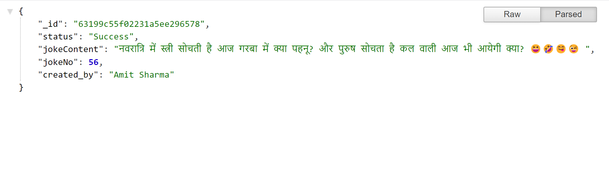

# Hindi Jokes API

 

## API Reference

#### Get all items

```http
  GET /jokes
```
```http
  https://hindi-jokes-api.onrender.com
```
***
**No api_key needed free forever**  
***
 
 

## How response looks like
 
 



## 🔗 API

[Api Url](https://hindi-jokes-api.onrender.com/jokes)
 

## Usage/Examples

**Using Fetch**
```javascript
 
const fetchData = async () => {
    const url = "https://hindi-jokes-api.onrender.com/jokes"
    const response = await fetch(url);
    const data = await response.json();
    console.log(data)
}
 
```

**Using Axios**

```javascript
// First you need to intall axios
npm i axios

// use axios 
 
const sendGetRequest = async () => {
    const url = "https://hindi-jokes-api.onrender.com/jokes"
    try {
        const resp = await axios.get(url);
        console.log(resp.data);
    } catch (err) {
        // Handle Error Here
        console.error(err);
    }
};
 
```

## Contributing

Contributions are always welcome!

See `contribute.md` for ways to get started.
 


## Authors

- [@amitSharma7741](https://github.com/amitSharma7741)


## 🚀 About Me
I'm a full stack web developer...


 
 


